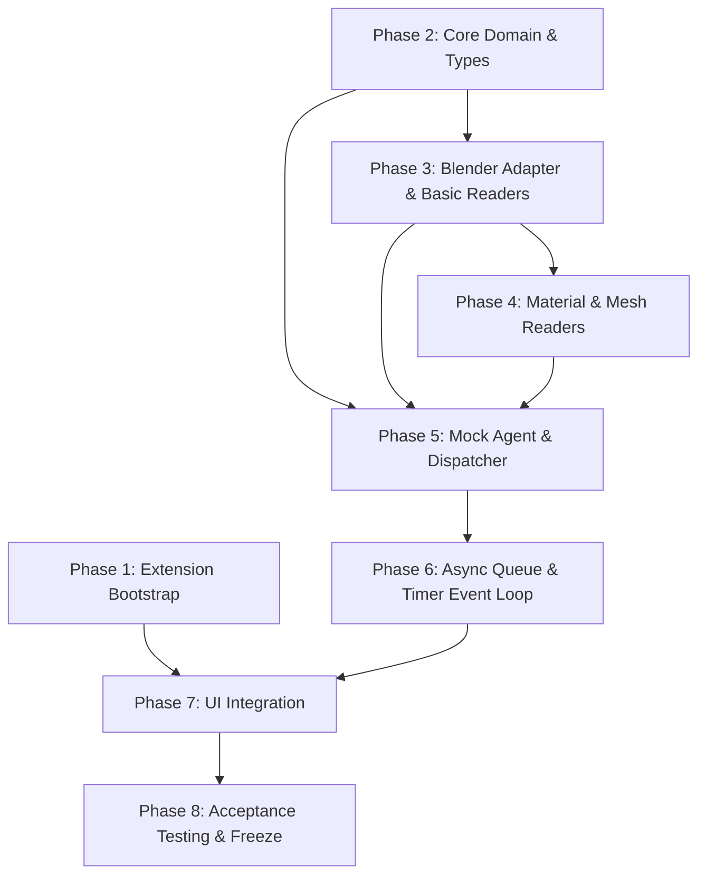
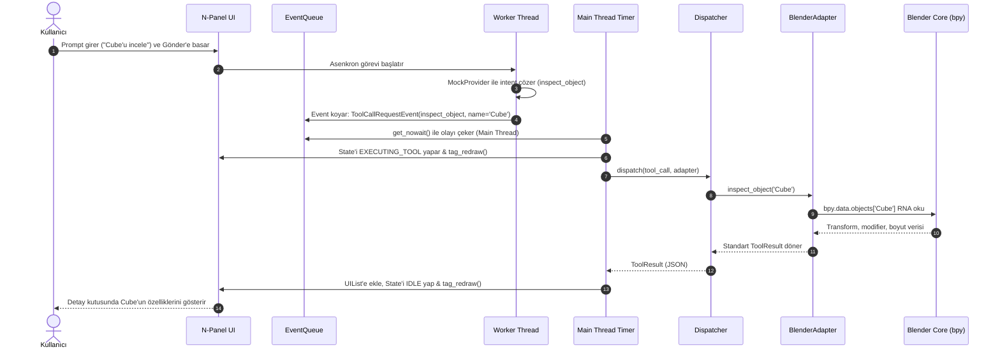

# Blender AI Sidebar — Milestone 1 (Grounding PoC) Implementation Plan

> **Hedef:** Blender 5.2.1 LTS üzerinde çalışan; sahneyi dondurmayan, ana iş parçacığı güvenliğini koruyan, token-tasarruflu 5 salt-okunur (read-only) aracı deterministik JSON çıktılarıyla icra eden ve yerel N-Panel arayüzünde gösteren minimal Grounding altyapısının kurulması.

---

## 1. Mimari Düzeltmeler ve Kesinleşen Prensipler

### 1.1. `inspect_material` Sözleşmesi (Dual-Entry Semantiği)
Bir nesnenin birden fazla malzeme yuvası (material slot) bulunabilir. Araç belirsizliği önlemek için çift girişli deterministik bir sözleşme uygular:
* **Girdi Seçeneği A (Doğrudan Malzeme Adı):** `material_name: str` (Ör: `"MedievalWood"`)
* **Girdi Seçeneği B (Obje ve Yuva İndeksi):** `object_name: str`, opsiyonel `slot_index: int = 0` (Ör: `"House"`, slot `0`)
* **Çıktı Detayı:** Her iki durumda da dönen JSON hem malzemenin düğüm/özellik analizini hem de atandığı obje/yuva bağlamını içerir.

### 1.2. Blender Nesne Kimliği (Identity Architecture)
* **Kullanıcı & Model Katmanı:** Okunabilirlik için `name` (string) birincil referanstır.
* **Adapter / Dahili Katman:** Blender'da yerel ve harici kütüphane nesneleri aynı ismi taşıyabilir. M1 şeması nesneleri `name`, `type`, `is_linked` ve `library_name` ile niteler.
* **Gelecek Genişlemesi (M3+):** Blender 2.83+'dan beri var olan ve 5.2'de de doğruladığımız `bpy.types.ID.session_uid` (oturum bazlı değişmez C tamsayısı), M3 mutasyonlarında objeler yeniden adlandırılsa dahi referansın kopmaması için dahili takip mekanizmasında kullanılacaktır.

### 1.3. UI Redraw & Threading Sınırı
* **Worker Thread:** Kesinlikle hiçbir `bpy.types.Area`, `Region`, `Space` veya `bpy.data` nesnesine dokunmaz. Yalnızca salt Python veri yapılarını içeren olayları `queue.Queue` içine atar.
* **Main Thread (Timer):** `bpy.app.timers` döngüsü ana iş parçacığında çalışarak kuyruktan olayları çeker (`queue.get_nowait()`), UI durumunu (`bpy.types.WindowManager` property'leri) günceller ve 3D Viewport alanlarını `area.tag_redraw()` ile güvenli biçimde yeniden çizdirir.

### 1.4. M1 Mock Provider & Gerçek Araç Omurgası
* M1'de karmaşık bir LLM planner kurulmayacaktır.
* Deterministik bir **Mock Provider** kullanılacaktır:
  * `"Mevcut sahneyi incele"` → `inspect_scene()`
  * `"Seçimi incele"` → `inspect_selection()`
  * `"Cube'u incele"` → `inspect_object(name='Cube')"`
  * `"Cube malzemesini incele"` → `inspect_material(object_name='Cube', slot_index=0)`
  * `"Cube geometrisini incele"` → `inspect_mesh(object_name='Cube')`
* **Kritik:** Tool Registry, BaseTool, ToolResult ve ToolDispatcher sınıfları M1'de gerçek mimari olarak yazılacak; M2'ye geçildiğinde yalnızca Mock Provider çıkarılıp yerine SSE Streaming LLM Provider takılacaktır.

---

## 2. Dizin Yapısı (Milestone 1 File Tree)

```text
c:\Users\Halil Emre\Desktop\GitHub\Public\Blender AI Sidebar/
├── blender_manifest.toml            # Blender 4.2+ / 5.2 Extension Manifestosu
├── __init__.py                      # Extension lifecycle (register / unregister)
├── core/
│   ├── __init__.py
│   ├── types.py                     # RiskLevel, ToolResult, ToolCallRequest veri modelleri
│   ├── state_machine.py             # AgentStateMachine (IDLE, PROCESSING, EXECUTING, ERROR)
│   ├── event_queue.py               # Thread-safe queue & worker-main event modelleri
│   └── event_loop.py                # bpy.app.timers adaptif event tüketim mekanizması
├── tools/
│   ├── __init__.py
│   ├── base.py                      # BaseTool abstract sınıfı ve şema doğrulayıcı
│   ├── registry.py                  # ToolRegistry (tescil, discovery, JSON şema üretimi)
│   └── read_only/
│       ├── __init__.py
│       ├── inspect_scene.py         # Kuşbakışı sahne özeti aracı
│       ├── inspect_selection.py     # Aktif/seçili nesne ve mod aracı
│       ├── inspect_object.py        # Hedef obje detaylı transform & modifer aracı
│       ├── inspect_material.py      # Dual-entry malzeme ve Principled BSDF aracı
│       └── inspect_mesh.py          # Vertex, poligon ve bounding box aracı
├── adapter/
│   ├── __init__.py
│   ├── blender_adapter.py           # Ana Adapter facade arayüzü
│   ├── readers/
│   │   ├── __init__.py
│   │   ├── scene_reader.py          # bpy.data.scenes ve koleksiyon hiyerarşisi okuyucu
│   │   ├── selection_reader.py      # bpy.context.view_layer seçim okuyucu
│   │   ├── object_reader.py         # RNA transform, boyut ve modifier okuyucu
│   │   ├── material_reader.py       # Malzeme yuvası ve Principled BSDF okuyucu
│   │   └── mesh_reader.py           # Poligon dökümü ve bounding box okuyucu
│   └── context_resolver.py          # VIEW_3D ve pencere context tespit yardımcısı
├── agent/
│   ├── __init__.py
│   ├── mock_provider.py             # Deterministik prompt -> tool çağrısı üretici
│   └── dispatcher.py                # Tool yürütme ve sonuç normalleştirme motoru
├── ui/
│   ├── __init__.py
│   ├── properties.py                # WindowManager / Scene UI State Property tanımları
│   ├── panel.py                     # 3D Viewport N-Panel ana UI çizimi
│   ├── uilist.py                    # Tarihçe için bpy.types.UIList bileşeni
│   └── operators.py                 # UI buton operatorleri (Gönder, Temizle, Seçileni İncele)
└── tests/
    ├── __init__.py
    ├── run_unit_tests.py            # Pure Python birim test koşucusu (Blender gerektirmez)
    ├── run_blender_tests.py         # Blender headless entegrasyon test koşucusu
    ├── unit/
    │   ├── test_types.py            # ToolResult ve RiskLevel testleri
    │   ├── test_registry.py         # ToolRegistry tescil ve şema testleri
    │   └── test_mock_provider.py    # Deterministik komut eşleştirme testleri
    └── integration/
        ├── test_extension_load.py   # Manifest ve extension lifecycle testi
        ├── test_grounding_tools.py  # 5 okuma aracının gerçek Blender sahnelerinde testi
        └── test_threading_queue.py  # Worker -> queue -> timer ana thread güvenliği testi
```

---

## 3. Atomik Aşamalar (Phase Breakdown)

### Phase 1: Extension Bootstrap
* **Amaç:** Blender 5.2.1 LTS'nin eklentiyi yerel Extension olarak tanıması, etkinleştirebilmesi ve 3D Viewport'ta boş da olsa bir N-Panel sekmesi açabilmesi.
* **Oluşturulacak Dosyalar:**
  * `blender_manifest.toml`
  * `__init__.py`
  * `ui/properties.py`
  * `ui/panel.py`
* **Yeni Sınıf/Fonksiyonlar:**
  * `AISIDEBAR_PT_main_panel(bpy.types.Panel)`
  * `AISidebarSceneProperties(bpy.types.PropertyGroup)`
  * `register()`, `unregister()`
* **Bağımlılıklar:** Yalnızca Blender yerel `bpy`.
* **Kabul Kriterleri:**
  * `blender.exe --background --python-expr "import addon_utils; ..."` ile 0 hata ile enable edilir.
  * Blender arayüzünde `VIEW_3D > Sidebar (N) > AI Sidebar` sekmesi görünür.
* **Test Yöntemi:** `tests/integration/test_extension_load.py` headless testi.

---

### Phase 2: Core Domain & Tool Foundation
* **Amaç:** Hiçbir Blender bağımlılığı içermeyen, tamamen izole ve test edilebilir araç sözleşmesi (`BaseTool`, `ToolResult`, `RiskLevel`) ve merkezi `ToolRegistry` altyapısının kurulması.
* **Oluşturulacak Dosyalar:**
  * `core/types.py`
  * `tools/base.py`
  * `tools/registry.py`
  * `tests/unit/test_types.py`
  * `tests/unit/test_registry.py`
* **Yeni Sınıf/Fonksiyonlar:**
  * `RiskLevel` (Enum / StrEnum)
  * `ToolResult` (Data class / Model)
  * `BaseTool` (Abstract Base Class)
  * `ToolRegistry` (register, get, list_schemas metotları)
* **Bağımlılıklar:** Pure Python (standart kütüphane).
* **Kabul Kriterleri:**
  * Sahte bir test aracı tescil edilip JSON şeması üretilebilmeli.
  * Hatalı ve başarılı `ToolResult` nesneleri tam olarak Bölüm C'deki formata uymalı.
* **Test Yöntemi:** `python tests/run_unit_tests.py` (Blender gerekmeden milisaniyeler içinde koşar).

---

### Phase 3: Blender Adapter & Temel Okuyucular (Scene, Selection, Object)
* **Amaç:** Blender C/RNA verisini model dostu deterministik JSON yapılarına dönüştüren ilk 3 okuma aracının ve Adapter katmanının kodlanması.
* **Oluşturulacak Dosyalar:**
  * `adapter/blender_adapter.py`
  * `adapter/readers/scene_reader.py`
  * `adapter/readers/selection_reader.py`
  * `adapter/readers/object_reader.py`
  * `tools/read_only/inspect_scene.py`
  * `tools/read_only/inspect_selection.py`
  * `tools/read_only/inspect_object.py`
* **Yeni Sınıf/Fonksiyonlar:**
  * `BlenderAdapter` facade sınıfı
  * `SceneReader.read(scene) -> dict`
  * `SelectionReader.read(context) -> dict`
  * `ObjectReader.read(obj_name, include_evaluated=False) -> dict`
  * `InspectSceneTool`, `InspectSelectionTool`, `InspectObjectTool`
* **Bağımlılıklar:** Phase 2 (BaseTool, ToolResult).
* **Kabul Kriterleri:**
  * Standart sahnede (Cube, Light, Camera) `inspect_scene` tam ve deterministik JSON döner.
  * Sahnede obje seçili değilken `inspect_selection` crash etmez, `active_object: null` döner.
  * Olmayan obje arandığında `inspect_object` `OBJECT_NOT_FOUND` structured error döner.
* **Test Yöntemi:** `blender.exe --background --python tests/integration/test_grounding_tools.py`.

---

### Phase 4: İleri Okuma Araçları (Material & Mesh)
* **Amaç:** Malzeme yuvalarını, Principled BSDF parametrelerini ve poligon/geometri dökümünü çıkaran kalan 2 grounding aracının tamamlanması.
* **Oluşturulacak Dosyalar:**
  * `adapter/readers/material_reader.py`
  * `adapter/readers/mesh_reader.py`
  * `tools/read_only/inspect_material.py`
  * `tools/read_only/inspect_mesh.py`
* **Yeni Sınıf/Fonksiyonlar:**
  * `MaterialReader.read(mat_name=None, obj_name=None, slot_index=0) -> dict`
  * `MeshReader.read(obj_name) -> dict`
  * `InspectMaterialTool`, `InspectMeshTool`
* **Bağımlılıklar:** Phase 3 (BlenderAdapter).
* **Kabul Kriterleri:**
  * Cube'un varsayılan malzemesinde Principled BSDF değerleri (color, roughness, metallic) doğru okunur.
  * Malzemesi olmayan bir objede veya Camera/Light üzerinde güvenli `NO_MATERIAL_ASSIGNED` / `INVALID_DATA_TYPE` hataları döner.
  * Cube üzerinde 8 vertex, 6 quad poligon bilgisi deterministik olarak döner.
* **Test Yöntemi:** `blender.exe --background --python tests/integration/test_grounding_tools.py`.

---

### Phase 5: Mock Agent & Tool Dispatcher
* **Amaç:** Kullanıcı promptunu deterministik araç çağrısına dönüştüren Mock Provider ile aracın çalıştırılıp sonucunun normalize edildiği Dispatcher omurgasının kurulması.
* **Oluşturulacak Dosyalar:**
  * `core/state_machine.py`
  * `agent/mock_provider.py`
  * `agent/dispatcher.py`
  * `tests/unit/test_mock_provider.py`
* **Yeni Sınıf/Fonksiyonlar:**
  * `AgentStateMachine` (`IDLE`, `PROCESSING`, `EXECUTING_TOOL`, `ERROR`)
  * `MockProvider.parse_intent(prompt: str) -> ToolCallRequest`
  * `ToolDispatcher.dispatch(tool_call, adapter) -> ToolResult`
* **Bağımlılıklar:** Phase 2, Phase 3, Phase 4.
* **Kabul Kriterleri:**
  * `"Cube'u incele"` dendiğinde `inspect_object(name='Cube')` çağrısı üretilir ve sonuç `ToolResult` olarak elde edilir.
  * Tanınmayan bir prompt geldiğinde durum makinesi güvenli biçimde `IDLE`'a döner veya açıklayıcı mesaj üretir.
* **Test Yöntemi:** Pure Python unit testleri + headless dispatcher testi.

---

### Phase 6: Async Sınırı & Event Loop (Thread-Safe Execution)
* **Amaç:** Blender'ın ana iş parçacığı ile arka plan iş parçacığını kesin olarak izole eden; HTTP/LLM simülasyonunu arka planda, `bpy` okumalarını ise ana iş parçacığında `bpy.app.timers` ile koşturan event loop mekanizması.
* **Oluşturulacak Dosyalar:**
  * `core/event_queue.py`
  * `core/event_loop.py`
* **Yeni Sınıf/Fonksiyonlar:**
  * `AgentEventQueue` (`queue.Queue` sarmalayıcısı)
  * `WorkerThread` (Arka planda mock LLM çalıştıran iş parçacığı)
  * `EventLoopTimer` (`bpy.app.timers` adaptif tüketim callback'i)
  * `lifecycle_cleanup()` (Blender kapanırken thread ve timer'ı sonlandıran fonksiyon)
* **Bağımlılıklar:** Phase 5 (Mock Agent, State Machine).
* **Kabul Kriterleri:**
  * Arka plan worker'ı `bpy` nesnelerine doğrudan asla dokunmaz.
  * Timer ana iş parçacığında kuyruğu tüketip UI durumunu günceller.
  * Eklenti devreden çıkarıldığında (`unregister`) arka plan thread'i ve timer temiz kapanır, konsolda uyarı kalmaz.
* **Test Yöntemi:** `blender.exe --background --python tests/integration/test_threading_queue.py`.

---

### Phase 7: UI Entegrasyonu (Kompakt N-Panel, UIList ve Detay Kutusu)
* **Amaç:** Geliştirilen tüm grounding motorunu 3D Viewport N-Panel'inde temiz, kompakt ve yerel Blender UX standartlarına uygun bir arayüze bağlamak.
* **Oluşturulacak Dosyalar:**
  * `ui/uilist.py`
  * `ui/panel.py` (güncelleme)
  * `ui/operators.py`
  * `ui/properties.py` (güncelleme)
* **Yeni Sınıf/Fonksiyonlar:**
  * `AISIDEBAR_UL_history(bpy.types.UIList)` (Kaydırılabilir geçmiş listesi)
  * `AISIDEBAR_OT_send_prompt(bpy.types.Operator)` (Prompt gönderme operatorü)
  * `AISIDEBAR_OT_clear_history(bpy.types.Operator)` (Geçmişi temizleme operatorü)
  * `draw_turn_detail()` (`textwrap` ile seçilen adımın JSON/metin dökümü)
* **Bağımlılıklar:** Phase 1, Phase 5, Phase 6.
* **Kabul Kriterleri:**
  * N-Panel'de prompt yazılıp "Gönder" butonuna basıldığında durum `PROCESSING` -> `EXECUTING_TOOL` -> `IDLE` olarak akar.
  * Sonuç `UIList`'e yeni bir satır olarak eklenir; tıklandığında alttaki detay kutusunda şema düzgün satır kaydırma (`textwrap`) ile okunur.
* **Test Yöntemi:** Manuel interaktif Blender smoke testi + headless UI operator testi.

---

### Phase 8: Acceptance Testing & Milestone 1 Freeze
* **Amaç:** Milestone 1 için belirlenen 10 kabul testinin tamamının hatasız geçtiğini resmi test koşucularıyla belgelemek.
* **Oluşturulacak Dosyalar:**
  * `tests/run_all_m1_tests.py`
  * `walkthrough.md` (Doğrulama sonuçları ve loglar)
* **Test Edilecek Senaryolar:**
  1. Clean installation & enable/disable
  2. Panel açılış ve UI layout doğrulaması
  3. `inspect_scene` tam sahne çıktısı
  4. `inspect_selection` (seçim var / seçim yok)
  5. `inspect_object` (var olan / olmayan obje)
  6. `inspect_material` (malzemeli obje / malzemesiz obje / doğrudan malzeme adı)
  7. `inspect_mesh` (mesh obje / mesh olmayan obje)
  8. Thread safety & 0 `bpy` access in background worker
  9. Mock E2E akışı (Prompt gir -> Araç çağrıl -> UIList güncelle -> Detay göster)
  10. Clean unregister & 0 resource leak
* **Kabul Kriterleri:** Tüm testler yeşil (Passed) olmalıdır.

---

## 4. Bağımlılık Grafiği (Dependency Graph)



---

## 5. Çalışma Akışı (Runtime Execution Flow)



---

## 6. Test Matrisi (Test Matrix)

| Test ID | Test Adı | Kapsanan Bileşen | Test Seviyesi | Beklenen Sonuç |
| :--- | :--- | :--- | :--- | :--- |
| **T01** | `test_types_contract` | `core/types.py` | Pure Python Unit | Başarılı/hatalı ToolResult şemaya tam uyar |
| **T02** | `test_registry_discovery` | `tools/registry.py` | Pure Python Unit | Kayıt edilen araçlar listelenir ve şema üretir |
| **T03** | `test_mock_provider_intents` | `agent/mock_provider.py`| Pure Python Unit | 5 temel prompt doğru araçlara eşlenir |
| **T04** | `test_manifest_validity` | `blender_manifest.toml` | Blender Headless | Blender 5.2 extension manifestosunu doğrular |
| **T05** | `test_extension_lifecycle`| `__init__.py` | Blender Headless | Addon register ve unregister hatasız tamamlanır |
| **T06** | `test_inspect_scene_output` | `inspect_scene.py` | Blender Headless | Default sahnede Camera, Cube, Light listelenir |
| **T07** | `test_inspect_selection_empty`| `inspect_selection.py`| Blender Headless | Seçim yokken `active_object: null` döner |
| **T08** | `test_inspect_object_not_found`| `inspect_object.py` | Blender Headless | Olmayan isimde `OBJECT_NOT_FOUND` hatası döner |
| **T09** | `test_inspect_material_dual`| `inspect_material.py` | Blender Headless | Hem obje+slot hem de isimle sorgu çalışır |
| **T10** | `test_inspect_mesh_invalid_type`| `inspect_mesh.py` | Blender Headless | Light/Camera için `INVALID_DATA_TYPE` döner |
| **T11** | `test_threading_isolation`| `core/event_loop.py` | Blender Headless | Worker thread içinde `bpy` çağrısı yapılmadığı kanıtlanır |
| **T12** | `test_e2e_mock_flow` | UI + Agent + Tools | Blender Headless | Prompt girişinden UIList güncellemesine tam zincir |

---

## 7. Phase 1 Implementation Task Listesi (Atomik ve Sıralı)

Aşağıdaki görevler kodlamaya başlandığında birebir bu sırayla icra edilecek; Phase 1 bittiğinde Blender 5.2 üzerinde doğrulanıp onayınıza sunulacaktır:

- [ ] **Task 1.1:** Proje kök dizininde Blender 4.2+ / 5.2 resmi Extensions standardına uygun `blender_manifest.toml` dosyasının oluşturulması.
- [ ] **Task 1.2:** Minimal UI state tutucusu olan `ui/properties.py` dosyasının (`AISidebarSceneProperties`) tanımlanması.
- [ ] **Task 1.3:** 3D Viewport N-Panelinde (`bl_space_type = 'VIEW_3D'`, `bl_region_type = 'UI'`, `bl_category = 'AI Sidebar'`) temel panel sınıfı `ui/panel.py` dosyasının oluşturulması.
- [ ] **Task 1.4:** Eklenti yaşam döngüsünü (`register`, `unregister`) yöneten kök `__init__.py` dosyasının yazılması.
- [ ] **Task 1.5:** Phase 1 headless doğrulama scripti `tests/integration/test_extension_load.py` dosyasının hazırlanması.
- [ ] **Task 1.6:** Sistemdeki Blender 5.2.1 LTS çalıştırılarak eklentinin temiz yüklendiğinin, register/unregister döngüsünün 0 hatayla çalıştığının test edilmesi ve raporlanması.

---

> [!IMPORTANT]
> **Kural:** Her aşama tamamlandığında sistem çalışır durumda kalacak; çıktı ve loglar size raporlanarak onayınız alındıktan sonra bir sonraki phase'e geçilecektir.
